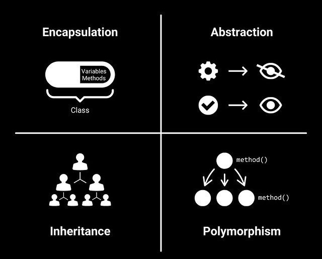

# Basics of Object-Oriented Programming (OOP)

## Introduction to Object-Oriented Programming (OOP)

Object-Oriented Programming (OOP) is a programming paradigm that organizes code into objects, which are instances of classes. It focuses on the concepts of abstraction, encapsulation, inheritance, and polymorphism.

OOP allows for modular and reusable code by providing a way to model real-world entities as objects with their own properties (attributes) and behaviors (methods). This approach promotes code organization, maintainability, and scalability.

In OOP, classes serve as blueprints for creating objects. They define the attributes and methods that objects of that class will have. Objects are instances of classes, and each object can have its own unique state while still sharing the same behavior defined by the class.

<span style="color:yellow">Abstraction</span>, <span style="color:yellow">encapsulation</span>, <span style="color:yellow">inheritance</span>, and <span style="color:yellow">polymorphism</span> are the four fundamental principles of OOP. They provide a way to structure and design software systems, making them more flexible, extensible, and easier to understand and maintain.

By using OOP, developers can create modular and reusable code, improve code organization and readability, and build complex systems that are easier to manage and evolve over time.

## Principles Of Object-Oriented Programming

- <span style="color:yellow">Abstraction</span>
- <span style="color:yellow">Encapsulation</span>
- <span style="color:yellow">Inheritance</span>
- <span style="color:yellow">Polymorphism</span>



## 1. Abstraction

- ```Abstraction means hiding internal details and showing the required things```

Abstraction is the process of simplifying complex systems by breaking them down into smaller, more manageable parts. It allows us to focus on the essential features of an object or system while hiding unnecessary details.

Example: Imagine a car. As a driver, <span style="color:yellow">you don't need to know</span> how the engine works internally. You only need to know how to start the car, accelerate brake, and change gears.

## 2. Encapsulation

- ```Encapsulation is the process of grouping data in a single section.```

Encapsulation is the practice of bundling data and methods that operate on that data into a single unit called an object. It provides data hiding and protects the internal state of an object from external interference.

Example: Complete television is single box where all the mechanism are hidden inside the box all are capsuled

## 3. Inheritance

  - ```Inheritance means designing an object or a class by re-using the properties of the existing class and object.```
- ```Inheritance is same as specialization.```

Inheritance is a mechanism that allows a class to inherit properties and behaviors from another class. It promotes code reuse and enables the creation of hierarchical relationships between classes.

Example: A old style television (idiot box) is transformed with extra features into slim and smart television where it re-used the properties of old television

## 4. Polymorphism```

 - ``` Polymorphism is a concept in which we can execute a single operation in different ways. ```
 - ```Polymorphism is same as generalization.```

Polymorphism allows objects of different classes to be treated as objects of a common superclass. It enables the use of a single interface to represent different types of objects, providing flexibility and extensibility.

Example: Consider a Shape superclass with a method called calculateArea(). We can have different subclasses like Circle and Rectangle that override the calculateArea() method to provide their own implementation.

## Class Vs Object