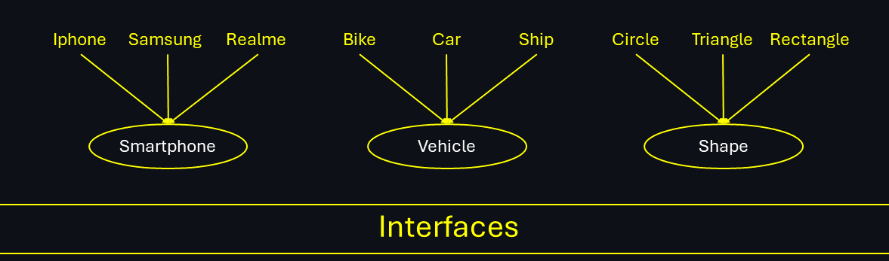
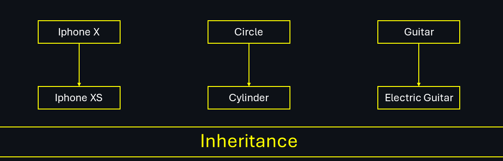
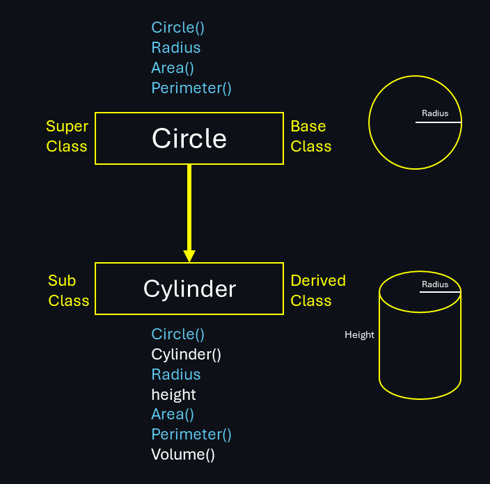
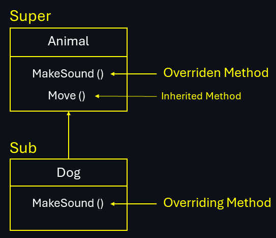
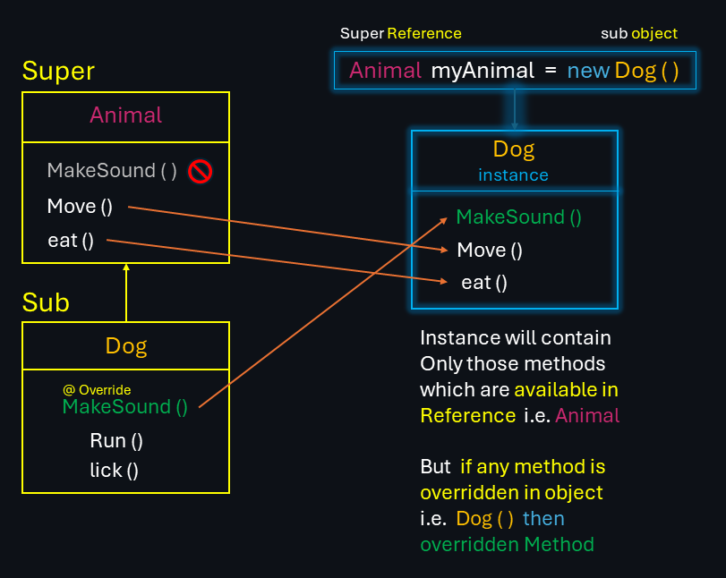

&nbsp;

# __Inheritance__ : _The Code Legacy Continues..._

 ___Like inheriting your parent's code, but without the family drama!___

### _Why Inheritance_ ?

- Reusability
- Extensibility
- Polymorphism
- Class Hierarchy
- Maintainability

&nbsp;

## ___1. Generalization vs Specialization___ 

### __A . Generalization__

- Generalization refers to the process of `creating a more general class from an existing class`, inheriting its attributes and behaviors.
- In Generalization `group of classes are referred with Super class with single name.`
- __In Generalization A Super Class Is made by Grouping Multiple Sub
Classes__.
- It allows for __code reuse__ and __promotes modularity__.

- Generalization means __Bottom Up__.

- Generalization is achieved using __Interfaces__.

- For achieving Generalization __Abstract Classes are Used__.

- __Example__ :

    

&nbsp;

### __B . Specialization__

- Specialization, on the other hand, refers to the process of creating `a more specific class from an existing class`, __adding new attributes and behaviors__.

- In Specialization __a new Sub Class is Generated by borrowing the
features of existing concrete class and adding new features to it.__

- It allows for creating specialized versions of a class to meet specific requirements.

- Specialization means __Top Down__.  

- Specialization is achieved using __Inheritance__.

- __Example__ :

    

## ___2. What is Inheritance___  

Inheritance allows one class (the subclass or derived class) __to inherit__ `attributes` and `methods` from another class (the superclass or base class).

### __Example :__



### Explanation

__1. ___Circle___ (Superclass)__ :

- __Attributes__: `radius`
- __Constructor__: `Circle()` - Default Constructor.
- __Methods__: `area()`, `Perimeter()` & `Circumference()`

&nbsp;

__2. ___Cylinder___ (Subclass)__ :

- __Inherits from `Circle`__.
- ___Additional___ __Attributes__: `height`
- __Constructor__: `Cylinder()` - Default Constructor.
- ___Additional___ __Methods__: `Volume()`

&nbsp;

### Code

```java
    class Circle
        {
            public double radius;

            public double area()
            {
                return Math.PI * radius *radius;
            }
    
            public double perimeter()
            {
                return 2*Math.PI*radius;
            }

            public double circumference()
            {
                return perimeter();
            }
        }


    class Cylinder extends Circle
        {
            public double height;
    
            public double volume()
            {
                return area()*height;
            }
    
        }
        

    public class main 
    {
       public static void main(String[] args) 
       {
           Cylinder c=new Cylinder();
          
           c.radius=7;
           c.height=10;
           
           System.out.println("Volume "+c.volume());
           System.out.println("Area "+c.area());       
        } 
    }
```

&nbsp;

## ___3. Constructors in Inheritance___
### __A. Order of Constructors :__

- Constructors are the __methods__ of class which are automatically called when an object is created.

- Constructors are executed from `Top to Bottom` Class.

- To make the child class object Firstly the parent class constructor must be created.

### __Example :__ [Try it Here](A_Constructors_In_Inheritance.java)

```cs

                        +---------------------+
                        |     Class Parent    |
                        |     Constructor()   |
                        +---------------------+
                                  |
                                  v
                        +---------------------+
                        |     Class Child     |
                        |     Constructor()   |
                        +---------------------+
                                  |
                                  v
                        +---------------------+
                        |   Class Grandchild  |
                        |   Constructor()     |
                        +---------------------+

```

### Explanation

- There are Three classes `Parent`, `Child` & `GrandChild`.
- __Parent__ is inherited by __Child__ & __Child__ is inherited by __GrandChild__.
- `Parent <- Child` & `Child <- GrandChild`.

- So, the Order of Constructors should be,
    1. Constructor of `Parent`
    2. Constructor of `child`
    3. Constructor of `GrandChild`

### Code

```java
    class Parent
    {
        public Parent()
        {
            System.out.println("Parent Constructor");
        }
                
    }

    class Child extends Parent   //Child inherited Parent  
    {
        public Child()
        {
            System.out.println("Child Constructor");
        }
    }

    class GrandChild extends Child  //GrandChild inherited Child 
    {
        public GrandChild()
        {
            System.out.println("Grand Child Constructor");
        }
    }

public class Constructors_In_Inheritance 
{

    public static void main(String[] args) 
    {
        Parent p = new Parent();            // Only Parent
        Child c = new Child();              // Parent + Child
        GrandChild GC = new GrandChild();   // Parent + Child + GrandChild      
    }
    
}
```

### Output of Code

```java
Parent Constructor

Parent Constructor
Child Constructor

Parent Constructor
Child Constructor
Grand Child Constructor
```

&nbsp;

### __B. Calling Parameterized Constructors :__ `super()`

- In above example, the constructors of Super Class which are called by Default are `Non-Parameterized Constructor or Default Constructor`.

- But if we want to __Call Parameterized Constructor for Super Class__ while creating object of Sub class, we use `super` keyword to address respective Super class of current constructor class.

- `super` : Nickname of super-class constructor in sub-class constructor.

### __Example__ : [Try it Here](B_Parameterized_constructors.java)

```java

class Parent
{
    int x;

    Parent()
    {
        System.out.println("Non-Parameterized Constructor of parent");
        System.out.println("x = " + x);
    }
    Parent(int x)
    {
        this.x = x;
        System.out.println("Parameterized Constructor of parent ");
        System.out.println("x = " + x);
    }
}


class Child extends Parent
{
    int y;

    Child()
    {
        System.out.println("Non-Parameterized Constructor of child");
        System.out.println("y = " + y);
    }

    Child(int y)
    {
        this.y = y;
        System.out.println("Parameterized Constructor of child");
        System.out.println("y = " + y);
    }

    Child(int x,int y)
    {
        super(x);  // Here we called parameterized constructor of super class
        
        System.out.println("Parameterized Constructor of child");
        System.out.println("y = " + y);
    }
}


public class Main {

    public static void main(String[] args) {

        System.out.println("\n 1. Both are Non-parameterized");
        Child c1=new Child();

        System.out.println("\n 2. Child is parameterized but parent is Non-parameterized");
        Child c2=new Child(20);

        System.out.println("\n 3. Both are Parameterized");
        Child c3=new Child(10,20);
    }

}
```

### Output of Code

```java
1. Both are Non-parameterized
Non-Parameterized Constructor of parent
x = 0
Non-Parameterized Constructor of child
y = 0

2. Child is parameterized but parent is Non-parameterized
Non-Parameterized Constructor of parent
x = 0
Parameterized Constructor of child
y = 20

3. Both are Parameterized
Parameterized Constructor of parent 
x = 10
Parameterized Constructor of child
y = 20
```

### Explanation

```sql
            +-----------------------------+
            |    Superclass: Parent       |
            +-----------------------------+
            |          X : int            |
            +-----------------------------+
            | + Parent()                  | <-- Default Constructor or Non-Parameterized Constructor
            | + Parent(X : int)           | <-- Parameterized Constructor
            +-----------------------------+
                           |
                           |
            +-----------------------------+
            |     Subclass: child         |
            +-----------------------------+
            |         Y : int             |
            +-----------------------------+
            | + child()                   | <-- Default Constructor or Non-Parameterized Constructor
            | + child (Y : int)           | <-- Parameterized Constructor 
            | + child (X : int, Y : int)  | <-- Parameterized Constructor
            +-----------------------------+
                           |
                           |
                           V
            +-----------------------------+
            | Sequence of Calls           |
            +-----------------------------+
            | child ()                    |  
            |  -> super()                 | <-- Calls Parent()
            |  -> Initialize Y            |
            +-----------------------------+
            | child (Y : int)             |
            |  -> super()                 | <-- Calls Parent()
            |  -> Initialize Y            |
            +-----------------------------+
            | child (X : int, Y : int)    |  
            |  -> super(X : int)          | <-- Calls Parent(X : int)
            |  -> Initialize Y            |
            +-----------------------------+
```

&nbsp;

## ___4. `this` v/s `super` Keyword___ 

The __`this`__ and __`super`__ keywords in Java are both used to refer to objects within the class hierarchy, but they serve different purposes and are used in different contexts. Here’s a detailed comparison along with examples to illustrate their usage:

### __A. `this` Keyword :__

- __Context__ : Within the same class.

- __Purpose__ :
  - Refers to the current object instance.
  - Used to __resolve naming conflicts__ between instance variables and parameters.
  - Can be used to __call other constructors__ in the same class.

- __Use Cases__ :
     1. Accessing instance variables and methods.

     2. Calling another constructor from a constructor _(constructor chaining)_.

&nbsp;

### __B. `super` Keyword :__

- __Context__ : In the context of a subclass.

- __Purpose__ :
  - Refers to the superclass (parent class) object instance.
  - Used to access __superclass methods and constructors__.
  - Used to call a method from the superclass that has been overridden in the subclass.

- __Use Cases__ :
     1. Accessing superclass methods and variables.

     2. Calling a constructor of the superclass from a subclass constructor.

&nbsp;

|Sr.  | Feature |  `this` Keyword | `super` Keyword   |
| -------- | -------- | -------- |----------|
| 1  | Context |Within the same class|  In the context of a subclass|
| 2  | Refers to  | Current object instance | Superclass (parent class) object instance |
| 3  | Used for | Accessing instance variables and methods| Accessing superclass methods and constructors|
| 4  | Constructor Chaining | Calls another constructor in the same class| Calls a constructor of the superclass |
| 5  |Method Invocation  | Invokes methods of the current class| Invokes methods of the superclass|

&nbsp;

### __Detailed Comparison with Examples :__

### `this` Keyword

__1. Resolving Naming Conflicts :__

```java
public class Circle {
    private double radius;

    public Circle(double radius) {
        this.radius = radius; // 'this.radius' refers to the instance variable, 'radius' refers to the parameter
    }

    public void setRadius(double radius) {
        this.radius = radius; // 'this.radius' refers to the instance variable, 'radius' refers to the parameter
    }

    public double getRadius() {
        return this.radius;
    }
}
```

&nbsp;

__2. Constructor Chaining :__

```java
public class Circle {
    private double radius;
    private String color;

    public Circle() {
        this(1.0, "red"); // Calls the parameterized constructor
    }

    public Circle(double radius, String color) {
        this.radius = radius;
        this.color = color;
    }
}
```

&nbsp;

### `super` Keyword

__1. Accessing Superclass Constructor :__

```java
public class Circle {
    private double radius;

    public Circle(double radius) {
        this.radius = radius;
    }
}

public class Cylinder extends Circle {
    private double height;

    public Cylinder(double radius, double height) {
        super(radius); // Calls the parameterized constructor of Circle
        this.height = height;
    }
}
```

&nbsp;

__2. Accessing Superclass Methods :__

```java
public class circle {
    private double radius;

    public double area() {
        return 3.14 * radius * radius;
    }
}

public class Cylinder extends Circle {
    double height;

    public double Volume() {
        double Area = super.area();   // calls area method from circle 
        return Area * height;
    }
}
```
&nbsp;
> [!NOTE]  
> 1. __You can also access Variables of inherited class with `this` keyword as after inheritance all properties of super-class are also part of properties of Sub-class.__
>
>___Example :___
>
>   ``` java
>class Circle
>{
>    double radius ;
>}
>
>class Cylinder extends Circle
>{
>    double height;
>
>    Cylinder(double radius, double height)
>
>    {
>        this.radius = radius;  // variable from super class
>        this.height = height;
>    }
>}
>
>public class Main {
>    public static void main(String[] args) {
>
>        Cylinder c = new Cylinder(2.5, 5.0);
>        System.out.println(c.radius);
>        System.out.println(c.height);
>    }
>}
>```
>
>___Output :___ 
>
>```
>2.5
>5.0
>```
>&nbsp;
> 
>
> 2. __If Super class and sub class have a variable with same name then to access the specific variable from super-class , `super` is used otherwise it will refer to variable in sub-class__
>
> ___Example :___
>
>``` java
>class Parent
>{
>    String Variable = "Variable from Parent"; // Same name >variable
>   
>}
>
>class Child extends Parent
>{
>    String Variable = "Variable from Child"; // Same name variable
>    
>    void display()
>    {
>        System.out.println(super.Variable); // Variable from super class
>        System.out.println(Variable); // Variable from current class
>        // or System.out.println(this.Variable);
>    }
>}
>
>
>public class main 
>{
>    public static void main(String[] args) 
>    {
>           Child c = new Child();
>           c.display();
>    }   
>}
>```
>
>___Output :___
>
>```
>Variable from Parent
>Variable from Child
>```

&nbsp;

## ___5. Method Overriding___ 


- Method overriding is a feature that allows a subclass (child class) to provide a specific implementation of a method that is already defined in its superclass (parent class).
- The purpose of overriding is to allow the subclass to modify or extend the behavior of the method as defined in the parent class.

- Method will be called depending on the object.
- Method overriding is achieved in ___Inheritance___.

__Example :__



### __Key Points :__

__1. Same Method Signature :__ The overriding method must have the `same name`, `same return type`, and `same parameter list` as the method in the superclass.

__2. @Override Annotation :__ While not mandatory, it’s a good practice to use the `@Override` annotation. It helps the compiler to ensure that you are actually overriding a method from the superclass.

__3. Access Modifiers :__ The overriding method `cannot have a more restrictive access modifier than the method being overridden` (e.g., you cannot override a `public` method with a `protected` method).


### __Example__ : [Try it Here](C_Method_overriding.java)

```java
// Superclass
class Animal {

    // Method to be overridden
    public void makeSound() {
        System.out.println("Animal makes a sound");
    }

}

// Subclass
class Dog extends Animal {

    // Overriding the makeSound() method
    @Override
    public void makeSound() {
        System.out.println("Dog barks");
    }

}

public class C_method_overriding {
    public static void main(String[] args) {

        // Creating an instance of Animal
        Animal myAnimal = new Animal();
        myAnimal.makeSound();           // Output: Animal makes a sound

        // Creating an instance of Dog
        Dog myDog = new Dog();
        myDog.makeSound();              // Output: Dog barks
    }

}

```

### Explanation

&nbsp; __1. Superclass__ ___'Animal'___ :

- Defines a method `makeSound()` that prints "Animal makes a sound".

&nbsp; __2. Subclass__ ___'Dog'___ :

- ___`Overrides`___ the `makeSound()` method to print "Dog barks".

- Uses the `@Override` annotation to indicate that the method is overridden.

&nbsp; __3. Main method__ :

- Creates instances of 'Animal' and 'Dog 'and calls the `makeSound()` method on each to demonstrate method overriding.

&nbsp;

### Benefits of Method Overriding

1. __Runtime Polymorphism__ : Allows a class to define specific behavior that will be used when an object of that class is used through a reference of the superclass type.

2. __Code Reusability__ : Enables the reuse of existing methods with specific implementations for subclasses without changing the parent class.

3. __Flexibility__ : Provides flexibility to add or change behaviors of methods in subclasses, making the code easier to extend and maintain.

&nbsp;

> [!NOTE]
>
> 1. Java is ___`Case-Sensitive`___
>
> Example :
> ```java
>
> ```

> [!CAUTION]
>
> 2. __`Final`__ and __`static`__ methods ___cannot be overridden___.

> [!NOTE]
>
> 3. Method can be overridden with same or lenient (public, protected) access specifiers but the __stricter(private) access specifiers cannot be used in sub class__.

> [!CAUTION]
>
> 4. Method with ___`same name must have same return type`___ in any version of its overriding or overloading.

> [!NOTE]
>
> 5. ___Only in one situation it can have different return type___, `while returning the object of the same class`

&nbsp;

## ___6. Dynamic Method Dispatch___  

- Dynamic method dispatch allows the selection of the appropriate method implementation at runtime, based on the actual type of the object.

- This mechanism is crucial for achieving polymorphic behavior and supporting method overriding in subclass-subclass relationships.

- When a `super class reference holding the object of sub class` and overridden method is called then method of object will be called it is ___Dynamic Method Dispatch___.

### __Example__ : [Try it Here](D_Dynamic_method_dispatch.java)
_Let's illustrate dynamic method dispatch with a Java example involving superclass `Animal` and subclass `Dog`_ :

```java
// Superclass
class Animal {
    public void makeSound() {
        System.out.println("Animal makes a sound");
    }
    public void move() {
        System.out.println("Animal is moving");
    }
}

// Subclass - Dog
class Dog extends Animal {
    @Override
    public void makeSound() {
        System.out.println("Dog barks");
    }
}


public class Main {
    public static void main(String[] args) {

        Animal myAnimal = new Dog();  // Superclass reference points to a Dog object

        myAnimal.makeSound();  // Output: Dog barks (Dynamic Method Dispatch)

        myAnimal.move(); // Output: Animal is moving (Static Binding)
    }
}


```
### Explanation :

&nbsp; __1. Superclass Reference__ __'Animal'__ &nbsp; & &nbsp; __Subclass Object__ __'Dog'__ :

- `Animal` myAnimal = new `Dog()`  assigns a __Dog object__ to __Animal Reference__.

&nbsp; __2. Method Call__ :

- When `myAnimal.makeSound()` is called, the JVM determines the actual class of the object (`Dog`) ___at runtime___ and invokes the corresponding overridden method (`Dog.makeSound()`).

&nbsp;



&nbsp;

> [!CAUTION]
> `Sub-class reference` to `Super-class object` is not allowed in Dynamic method dispatch. 

 ``` cs
- Correct Usage:
+----------------------+          +----------------------+
|        Animal        |          |          Dog         |
|----------------------|          |----------------------|
| - makeSound()        |          | - makeSound()        |
|                      |          |                      |
+----------------------+          +----------------------+

    Animal myAnimal = new Dog();   // Superclass reference to subclass object
    myAnimal.makeSound();          // Dynamic method dispatch occurs

- Incorrect Usage:
+----------------------+          +----------------------+
|        Animal        |          |          Dog         |
|----------------------|          |----------------------|
| - makeSound()        |          | - makeSound()        |
|                      |          |                      |
+----------------------+          +----------------------+

    Dog myDog = new Animal();      // Compilation error: Subclass reference to superclass object
``` 
