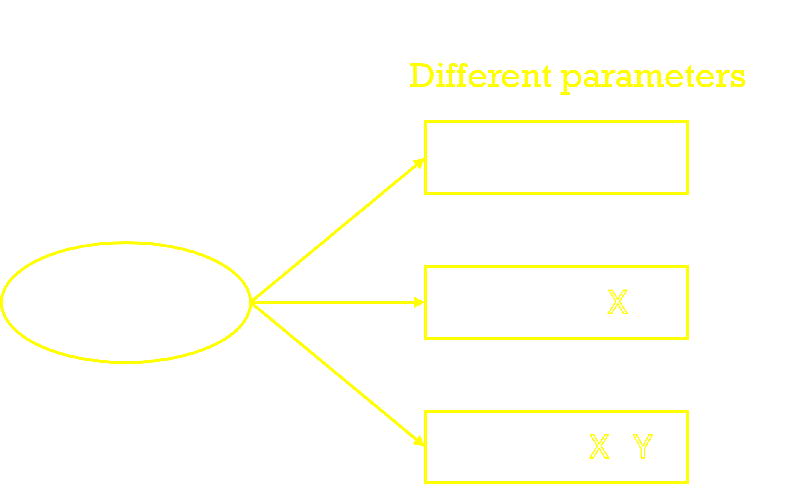
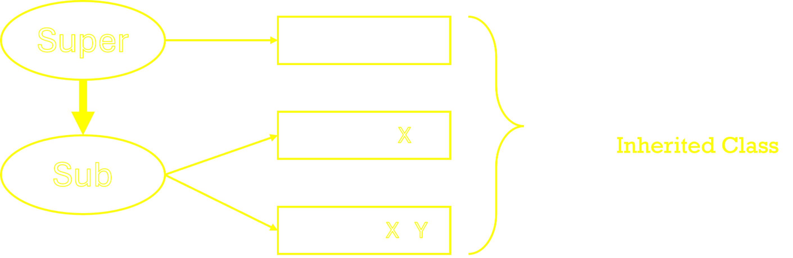

&nbsp;

# __Polymorphism__ : _Shape-shifting Code Wizards..._ 🧙🔮

 _Once upon a time in the enchanted kingdom of Java, there existed a powerful concept known as Polymorphism. Imagine Polymorphism as a shape-shifting wizard, capable of taking on many forms within your code kingdom. Let's embark on a magical journey to understand this enchanting concept!_

___The Essence of Polymorphism :___

_In the land of Java, Polymorphism allows one interface to be used for a multitude of actions. It's like having a magical wand that can transform into various tools depending on the situation. ✨_

### _What Polymorphism_ ?

Polymorphism is considered one of the important features of Object-Oriented Programming. Polymorphism allows us to perform a single action in different ways. \
In other words, polymorphism allows you to define one interface and have multiple implementations. The word “poly” means many and “morphs” means forms, So it means many forms.

### _Why Polymorphism_ ?

- Flexibility
- Reusability
- Extensibility
- Abstraction
- Dynamic Binding

&nbsp;
## ___Types of Polymorphism :___
### 1. __Compile-Time Polymorphism__ _(Static Binding)_
- __Method Overloading__
- __Generics__
- __Operator Overloading__ _( `Java doesn’t support the Operator Overloading` )_

### 2. __Run-Time Polymorphism__ _(Dynamic Binding)_

- __Method Overriding__
- __Dynamic Method Dispatch__
- __Upcasting and Downcasting__
- __Late Binding__
- __Virtual Method Invocation__

&nbsp;

## 1. __Compile-Time Polymorphism__ 

### __A . Method Overloading :__

- _Compile-time polymorphism in Java can be achieved using method overloading._

- ___Method overloading___ allows multiple methods to have the `same name but different parameters` (different type, number, or both).

- The correct method to be called is determined at compile-time based on the method signature.


 
&nbsp;&nbsp;&nbsp;&nbsp;&nbsp;&nbsp;&nbsp;&nbsp;&nbsp;&nbsp;&nbsp;&nbsp;&nbsp;&nbsp;&nbsp;&nbsp;&nbsp;&nbsp;


### __Example__ : [Try it Here](A_Method_Overloading.java)

```java
class AreaCalculator {

    // Method to calculate area of a square
    public double Area(double side) {
        return side * side;
    }

    // Overloaded method to calculate area of a rectangle
    public double Area(double length, double width) {
        return length * width;
    }

    // Overloaded method to calculate area of a circle
    public double Area(double radius) {
        return Math.PI * radius * radius;
    }
}

public class A_Method_Overloading {
    public static void main(String[] args) {
        AreaCalculator calculator = new AreaCalculator();

        // Calls Area(double) for a square
        System.out.println("Area of square with side 4: " + calculator.Area(4.0));

        // Calls Area(double, double) for a rectangle
        System.out.println("Area of rectangle with length 5 and width 3: " + calculator.Area(5.0, 3.0));

        // Calls Area(double) for a circle
        System.out.println("Area of circle with radius 2.5: " + calculator.Area(2.5));
    }
}
```

&nbsp;
- ### __Method Overloading works in inheritance hierarchy also.__
&nbsp;

&nbsp;&nbsp;&nbsp;&nbsp;&nbsp;&nbsp;&nbsp;&nbsp;&nbsp;&nbsp;&nbsp;&nbsp;&nbsp;&nbsp;&nbsp;&nbsp;&nbsp;&nbsp;

### __Example__ : [Try it Here](B_Method_Overloading.java)

```java
class Shape {

    // Method to calculate area of a square
    public double Area(double side) {
        return side * side;
    }

    // Overloaded method to calculate area of a rectangle
    public double Area(double length, double width) {
        return length * width;
    }
}

class Circle extends Shape {
    
    // Overloaded method to calculate area of a Circle
    public double Area(double radius) {
        return Math.PI * radius * radius;
    }
}

public class B_Method_Overloading {

    public static void main(String[] args) {
        Shape shape = new Shape();

        // Calls Area(double) for a square
        System.out.println("Area of square with side 4: " + shape.Area(4.0));

        // Calls Area(double, double) for a rectangle
        System.out.println("Area of rectangle with length 5 and width 3: " + shape.Area(5.0, 3.0));

        Circle circle = new Circle();
        // Calls Area(double) for a circle
        System.out.println("Area of circle with radius 2.5: " + circle.Area(2.5));
    }
}
```

&nbsp;


## 2. __Run-Time Polymorphism__

### __A . Method Overriding :__  &nbsp; [Revise >]( ../2.%20Inheritance/Readme.md#5-method-overriding)

- Runtime polymorphism in Java is achieved through method overriding. 
- Method overriding occurs when a subclass provides a specific implementation for a method that is already defined in its superclass. 
- This allows the subclass to modify or extend the behavior of the superclass method.

&nbsp;&nbsp;&nbsp;&nbsp;&nbsp;&nbsp;&nbsp;&nbsp;&nbsp;&nbsp;&nbsp;&nbsp;&nbsp;&nbsp;&nbsp;&nbsp;&nbsp;&nbsp;

### __Example__ : [Try it Here](../2.%20Inheritance/C_Method_overriding.java)

```java
// Superclass
class Animal {

    // Method to be overridden
    public void makeSound() {
        System.out.println("Animal makes a sound");
    }

}

// Subclass
class Dog extends Animal {

    // Overriding the makeSound() method
    @Override
    public void makeSound() {
        System.out.println("Dog barks");
    }

}

public class C_method_overriding {
    public static void main(String[] args) {

        // Creating an instance of Animal
        Animal myAnimal = new Animal();
        myAnimal.makeSound();           // Output: Animal makes a sound

        // Creating an instance of Dog
        Dog myDog = new Dog();
        myDog.makeSound();              // Output: Dog barks
    }

}

```

### __B . Dynamic Method Dispatch :__  &nbsp; [Revise >]( ../2.%20Inheritance/Readme.md#6-dynamic-method-dispatch)

- Dynamic method dispatch allows a method call to be resolved to the appropriate overridden method implementation `at runtime based on the actual object` being referenced, `rather than the type of the reference variable.`

- The method to be executed `makeSound` is determined at `runtime` based on the actual object type `Dog` even if referenced as `Animal`.

> [!NOTE]
> Only those methods are invocable which are `available in Reference`


### __Example__ : [Try it Here](D_Dynamic_method_dispatch.java)


```java
// Superclass
class Animal {
    public void makeSound() {
        System.out.println("Animal makes a sound");
    }
    public void move() {
        System.out.println("Animal is moving");
    }
}

// Subclass - Dog
class Dog extends Animal {
    @Override
    public void makeSound() {
        System.out.println("Dog barks");
    }
}


public class Main {
    public static void main(String[] args) {

        Animal myAnimal = new Dog();  // Superclass reference points to a Dog object

        myAnimal.makeSound();  // Output: Dog barks (Dynamic Method Dispatch)

        myAnimal.move(); // Output: Animal is moving (Static Binding)
    }
}

```
&nbsp;

## ___Comparing compile-time polymorphism and runtime polymorphism :___

|                | **Compile-time Polymorphism**                           | **Runtime Polymorphism**                            |
|-----------------------------|---------------------------------------------------------|----------------------------------------------------|
| **Definition**              | Polymorphism resolved at compile-time                   | Polymorphism resolved at runtime                   |
| **Other Name**              | Static Polymorphism                                     | Dynamic Polymorphism                               |
| **Mechanism**               | Method Overloading                                      | Method Overriding                                  |
| **Determination**           | The method to be invoked is determined at compile-time  | The method to be invoked is determined at runtime  |
| **Resolution**              | Resolved by the `compiler`                                | Resolved by the `JVM`                                |
| **Flexibility**             | `Less flexible`, as decisions are made at compile-time    | `More flexible`, as decisions are made at runtime    |
| **Use Case**                | Used for static type checking and improving readability | Used for implementing dynamic behavior             |
| **Performance**             | Generally `faster` due to early binding                   | Generally `slower` due to late binding               |