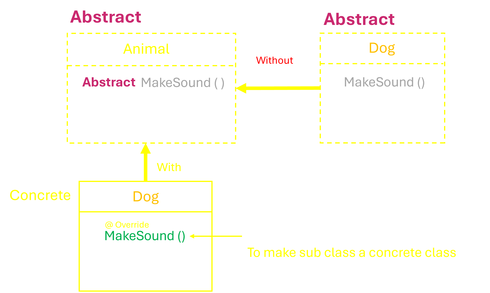

&nbsp;

# Abstraction : _Mastering the Art of Hiding Complexity ..._ 🛡️✨

### _What Abstraction_ ?

Abstraction is a key concept in Object-Oriented Programming (OOP) that focuses on hiding the internal complexities of a system and exposing only the necessary parts. It allows developers to work with higher-level concepts without worrying about the underlying details.

### _Why Abstraction_ ?

- _Simplicity_
- _Security_
- _Reusability_

### Achieving Abstraction in Java

_Abstraction in Java can be achieved through:_

- __Abstract Classes__

- __Interfaces__

&nbsp;

# __Abstract Classes__

#### `Abstraction + Inheritance`

### _# What is an Abstract Class ?_

- There are two types of classes `Abstract class` and `Concrete class`

- If `abstract` keyword is used before the class then it is an Abstract Class

``` java
abstract class <name> {.......}
```

- `Object cannot be created` for an Abstract class  

- Reference of abstract class is allowed.

&nbsp;

### _# What is an Abstract Method ?_

- `Method which is not having a body` is known as Abstract method, the method must be declared as abstract

``` java
abstract class <name> {
    public abstract <Method Name> ();  // Abstract method (does not have a body)
}
```

- The abstract method is `undefined` method.

- ___Even if at least one of the  methods is abstract then the class is Abstract class.___

&nbsp;

### _# How to Inherit Abstract Class ?_

- As Abstract class : If any other class inherits abstract class then that class also becomes
abstract class. A Sub class must override an abstract method or else it will become abstract class
- As Concrete class : `subclass must override the all undefined method and provide body to all undefined method`

- A class becomes useful if it overrides all the methods of abstract class

&nbsp;

&nbsp;&nbsp;&nbsp;&nbsp;&nbsp;&nbsp;&nbsp;&nbsp;&nbsp;&nbsp;&nbsp;&nbsp;&nbsp;

&nbsp;

### Example

- #### Abstract Class : Animal

```java
abstract class Animal {

    // Abstract method (does not have a body)
    public abstract void makeSound();

    // Concrete method
    public void sleep() {
        System.out.println("Animal is sleeping.");
    }
}
```

- #### Subclass : Dog

```java
class Dog extends Animal {

    // Implementing the abstract method
    @Override
    public void makeSound() {
        System.out.println("Dog barks.");
    }

    // Additional method specific to Dog
    public void wagTail() {
        System.out.println("Dog is wagging its tail.");
    }
}
```

- #### Implementation

```java
public class A_Abstract_class {

    public static void main(String[] args) {
        // Create an instance of Concrete class Dog 
        Dog dog = new Dog();
        
        // Call the methods
        dog.makeSound();  // Outputs: Dog barks.
        dog.sleep();      // Outputs: Animal is sleeping.
        dog.wagTail();    // Outputs: Dog is wagging its tail.
    }
}
```

> [!CAUTION]
> An Abstract class & An Abstract Method `can neither be final nor static` because if it is made final then it cannot be extended whereas abstract class is `meant for inheritance` & cannot be overridden whereas Abstract method is `meant for overriding`.

&nbsp;

### _# What is the use of abstract class ?_

- Abstract classes are used for `imposing standards` and `sharing methods`

- Sub classes are `meant for following standards`

&nbsp;

# __Interfaces__

#### `Abstraction + Polymorphism (Runtime-polymorphism )`

### _# What are Interfaces ?_

#### __Interface__ is like a Abstract class where

- All Methods are by default `abstract`
- All Variable are by default `Public` , `final` & `Static`.
- Which `supports multiple inheritance`.
- Classes are extended but `Interfaces are implemented`.

### Example

- #### Interface : Animal

```java
interface Animal {

    int LEGS = 4;      // Variables (implicitly public, static, and final)

    void makeSound();  // Abstract method

    void eat();        // Abstract method
}
```

- #### Class : Dog

```java
class Dog implements Animal {

    @Override
    public void makeSound() {
        System.out.println("Dog barks.");
    }

    @Override
    public void eat() {
        System.out.println("Dog eats kibble.");
    }

    public void wagTail() {
        System.out.println("Dog is wagging its tail.");
    }
}
```

&nbsp;

### _# Important about Interfaces :_

1. As methods are to be implemented by the classes, `they can’t be made private.`

&nbsp;

2. Identifiers can be used in interfaces but the identifiers must be given in Upper cases.

    - Identifiers are by default final and static.

```java
interface Animal {

    int LEGS = 4;      // Variables (implicitly public, static, and final)
}
```

&nbsp;

3. Method inside an interface cannot have body but `the method can have body if the method is static Method or default Method`

    - `Static Methods` : It can be called without an instance of the interface.
        - Static methods in interfaces are meant for utility or helper methods, and they belong to the interface itself, not to the instances.

    - `Default Methods` : provides a default implementation that can be inherited by implementing classes.
        - Implementing classes can override default methods if needed.

##### _By including static and default methods in interfaces, Java provides more flexibility and helps in evolving interfaces in a backward-compatible way_

``` java
interface Animal {

    // Default method with a body
    default void sleep() {
        System.out.println(getName() + " is sleeping.");
    }

    // Static method with a body
    static void printType() {
        System.out.println("This is an " + TYPE);
    }
}
```

&nbsp;

4. Static members can be accessed in main method by using interface name and dot operator.

&nbsp;

5. An interface can be extended from another interface.

```java
public interface Interface_A {
    void method_A();
}

public interface Interface_B extends Interface_A {
    void method_B();
}
```
&nbsp;

6. `Interface References` : You can create references of an interface type, which can point to objects of any class that implements the interface.
```java
    Animal d = new Dog();
```

