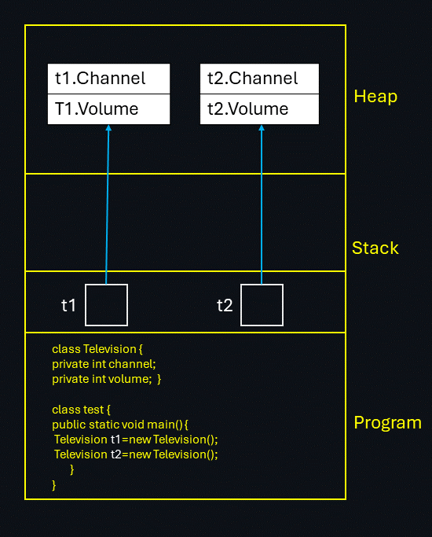
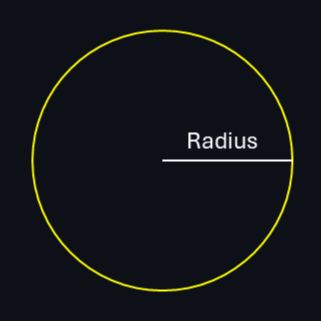
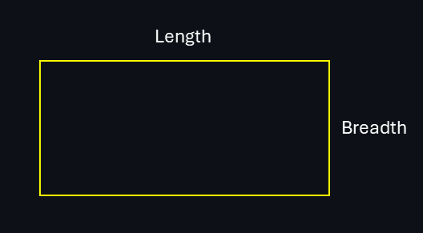
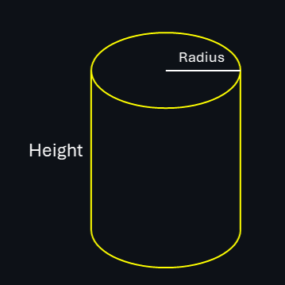
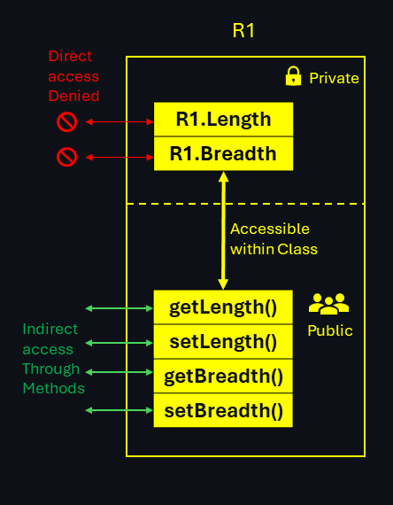
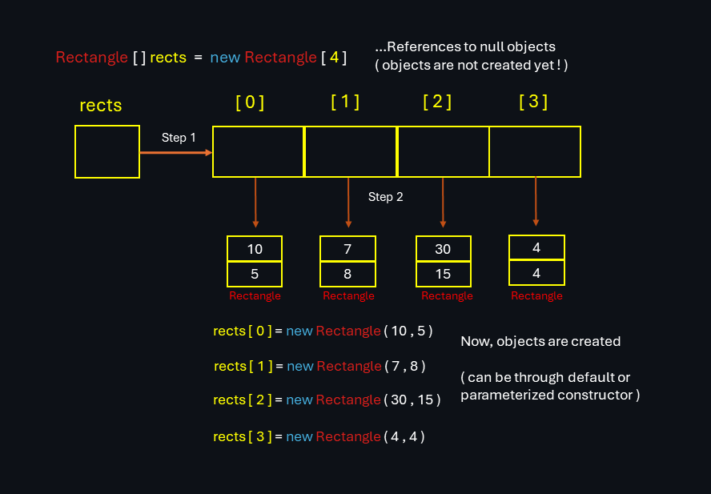

# Basics of Object-Oriented Programming (OOP)

&nbsp;

## 1.Introduction to Object-Oriented Programming (OOP)(#IntroductiontoObjectOrientedProgramming)

Object-Oriented Programming (OOP) is a programming paradigm that organizes code into objects, which are instances of classes. It focuses on the concepts of abstraction, encapsulation, inheritance, and polymorphism.

OOP allows for modular and reusable code by providing a way to model real-world entities as objects with their own properties (attributes) and behaviors (methods). This approach promotes code organization, maintainability, and scalability.

In OOP, classes serve as blueprints for creating objects. They define the attributes and methods that objects of that class will have. Objects are instances of classes, and each object can have its own unique state while still sharing the same behavior defined by the class.

<span style="color:yellow">Abstraction</span>, <span style="color:yellow">encapsulation</span>, <span style="color:yellow">inheritance</span>, and <span style="color:yellow">polymorphism</span> are the four fundamental principles of OOP. They provide a way to structure and design software systems, making them more flexible, extensible, and easier to understand and maintain.

By using OOP, developers can create modular and reusable code, improve code organization and readability, and build complex systems that are easier to manage and evolve over time.

## Principles Of Object-Oriented Programming

- <span style="color:yellow">Abstraction</span>
- <span style="color:yellow">Encapsulation</span>
- <span style="color:yellow">Inheritance</span>
- <span style="color:yellow">Polymorphism</span>

&nbsp;


&nbsp;

## A. Abstraction

- ```Abstraction means hiding internal details and showing the required things```

Abstraction is the process of simplifying complex systems by breaking them down into smaller, more manageable parts. It allows us to focus on the essential features of an object or system while hiding unnecessary details.

Example: Imagine a car. As a driver, <span style="color:yellow">you don't need to know</span> how the engine works internally. You only need to know how to start the car, accelerate brake, and change gears.

&nbsp;

## B. Encapsulation

- ```Encapsulation is the process of grouping data in a single section.```

Encapsulation is the practice of bundling data and methods that operate on that data into a single unit called an object. It provides data hiding and protects the internal state of an object from external interference.

Example: Complete television is single box where all the mechanism are hidden inside the box all are capsuled

&nbsp;

## C. Inheritance

- ```Inheritance means designing an object or a class by re-using the properties of the existing class and object.```
- ```Inheritance is same as specialization.```

Inheritance is a mechanism that allows a class to inherit properties and behaviors from another class. It promotes code reuse and enables the creation of hierarchical relationships between classes.

Example: A old style television (idiot box) is transformed with extra features into slim and smart television where it re-used the properties of old television

&nbsp;

## D. Polymorphism

- ``` Polymorphism is a concept in which we can execute a single operation in different ways. ```
- ```Polymorphism is same as generalization.```

Polymorphism allows objects of different classes to be treated as objects of a common superclass. It enables the use of a single interface to represent different types of objects, providing flexibility and extensibility.

Example: Consider a Shape superclass with a method called calculateArea(). We can have different subclasses like Circle and Rectangle that override the calculateArea() method to provide their own implementation.

&nbsp;

## 2. Class Vs Object


- Object is defined in terms of its `properties` and `behavior`
- Operation of behaviors will affect the properties.
- Anything in the world can be defined in the terms of properties and behavior.

- For a `single class we can have many objects.`

- Multiple number of objects can be created by one single class  

`For example` :
A house or a car or a television is an object but the design or blueprint of the
object is a class.

### Example Program 


```
class Television { 

    private int channel; 
    private int volume; 
 
    public void changechannel() 
    public void changevolume() 
} 

class test 
{ 
    public static void main() { 

        Television t=new Television(); 
        t.changechannel(10); 
    } 
}
```
[For Demo Try it Here](A_class_circle.java)

- In java there is an area inside main memory which is known as
method area which contains all the methods.

- The definitions of the will be present inside the heap, as the objects will be based on the definitions so the objects are also present in heap.



&nbsp;

## 3. How to Write Classes

## A. Circle

- Radius



```
class Circle 
    {
        public double radius;
    
        public double area() {
            return Math.PI*radius*radius;
        }

        public double perimeter() {
            return 2*Math.PI*radius;
        }

        public double circumference() {
            return perimeter();
        } 
    }
```

&nbsp;

## B. Rectangle

- Length
- Breadth



```
class Rectangle 
    { 
        public int length; 
        public int breadth; 
 
        public int area() { 
            return length*breadth; 
        } 

        public int perimeter () { 
            return 2*(length+breadth); 
        } 
    }
```

&nbsp;

## C. Cylinder

- Length
- Breadth



```
class Cylinder 
    { 
        public double radius; 
        public double height; 
 
        public double lid_area() { 
            return 2*Math.PI*radius*radius; 
        } 

        public double Surface_area() { 
            return 2*Math.PI*radius*height; 
        } 

        public double Volume() { 
            return Math.PI*radius*radius*height; 
        } 
    }
```

&nbsp;

## D. Account

- Account Number
- Name
- Balance

```
class Account
    { 
        public long account_number; 
        public string name; 
        public double balance;
 
        public void Deposit (double amount) { 
            balance += amount; 
        }

        public void Withdraw (double amount) { 
            balance -= amount; 
        }  
    }
```

&nbsp;

## ``Important`` : `tostring()`

### A. Using the `Overriden` toString() Method

- The `toString()` method in Java is used to return a string representation of an object.

- It's often `overridden` in classes to provide a more meaningful or customized string representation of the object's state.

- Here's how you can use and override the toString() method in a Java class :

```
public class Car {
    String make;
    String model;
    int year;

    public Car(String make, String model, int year) {
        this.make = make;
        this.model = model;
        this.year = year;
    }

    @Override
    //we can override toString() method to get a string representation of our choice, Modify tostring method as you want.

    public String toString() {
        return year + " " + make + " " + model;
    }

}

class overriden_tostring {

    public static void main(String[] args) {

        Car myCar = new Car("Toyota", "Camry", 2022);

        //when we print an object, toString() method is called implicitly
        
        System.out.println(myCar);  // Output: 2022 Toyota Camry

        System.out.println(myCar.toString()); // Output: 2022 Toyota Camry
        
    }
}

```

[For Demo Try it Here](B_tostring_method.java)

&nbsp;

### B. Using the Default toString() Method

- If you don't override the toString() method in your class, Java will use the `default implementation` from the Object class.

- This default implementation returns a string that consists of `the class name, @ symbol, and the object's hash code`

```
class Car {
    String make;
    String model;
    int year;

    public Car(String make, String model, int year) {
        this.make = make;
        this.model = model;
        this.year = year;
    }
}

public class default_tostring { 

    public static void main(String[] args) {

        Car myCar = new Car("Toyota", "Camry", 2022);

        System.out.println(myCar);  // Output: Car@1f6e597d
        System.out.println(myCar.toString());  // Output: Car@1f6e597d
    }
}
```

&nbsp;

## 4. Data Hiding

- Data hiding is a concept in object-oriented programming (OOP) that refers to the practice of `hiding the internal state (data)` of an object and requiring all interactions with the object to be performed `through its public interface.`

- This is achieved by using access modifiers like `private`, `protected`, and `public` in languages such as Java, C++, and C#.

In languages like Java, you can achieve data hiding using `access modifiers`:

- `Public`: Allows unrestricted access from any other class or package.

- `Protected`: Allows access to members within the same class, subclasses, and classes in the same package.

- `Private`: Limits access to members (variables or methods) only within the same class.

### Example  : [For Demo Try it Here](C_data_hiding.java)

```
class Rectangle
{
    private double length;
    private double breadth;
    
    // 'get' Methods

    public double getLength() {
        return length;
    }
    
    public double getBreadth() {
        return breadth;
    }
    

    // 'set' Methods

    public void setLength(double l) {
        if(l>=0)
            length=l;
    }
    
    public void setBreadth(double b) {
        if(b>=0)
            breadth=b;
    }
}
```

&nbsp;



&nbsp;

## 5. Types of Properties

Properties are typically represented as instance variables (fields) within a class, and their readability and writability `are controlled using access modifiers (private, protected, public) along with getter and setter methods.`

- ### Read & Write Properties : (`get` & `set`)

    The most common type of properties in Java allows both reading and writing of the property's value. This is achieved by providing `both getter and setter methods` with appropriate access modifiers.

    ```
        Example: 
        Let's take a BankAccount class representing a bank account with a balance that can be both read and modified
    ```

    &nbsp;

- ### Read-only Properties : (`get`)

    Read-only properties are achieved by declaring a private field and providing `only a public getter method without a corresponding setter method.` This allows external code to `read the property's value but not modify it.`

    ```
        Example: 
        Imagine a Student class where the student's ID is set during object creation and should not be changed afterward
    ```

    &nbsp;

- ### Write-only Properties : (`set`)

    Writable properties in Java are less common but can be achieved by providing a `public setter method without a corresponding getter method`. This allows external code to `modify the property's value but not directly read it.`

    ```
        Example: 
        Imagine a TemperatureSensor class that represents a sensor in a smart home system. The sensor measures the temperature, and the temperature value can be updated by the sensor but should not be directly read by external code
    ```

    &nbsp;

## 6. Constructors

- Constructors are used to `initialize the state of objects by providing initial values` to their attributes (fields) when they are created.

- They ensure that objects are in a valid and usable state upon instantiation.

### Syntax

- Constructors have the `same name as the class`

- `Don't have a return type` (not even void)

    ```
    public class rectangle {

        public rectangle() {  ..... Constructor declaration

            .... Constructor body

        }
    } 
    ```

&nbsp;

## 7. Types of Constructors

### A . `Default` Constructor

- Java provide a default constructor `if no constructors are explicitly defined` in the class. The default constructor `initializes attributes to default values` (e.g., 0 for numeric types, null for references).

- `Default constructor can be explicitly declared`, according to desired default values.

&nbsp;

### Implicit Constructor (`Automatically created` & called)

```
    public class Rectangle {

            private int length;
            private int width;

    public static void main(String[] args) {

        Rectangle rect = new Rectangle();   // Calls the default constructor

        // Output: rect.Length: 0, rect.Width: 0 (Default values according language type)
    }
}
```


### Explicit Constructor (`Manually created` & called)

```
public class Rectangle {

            private int length;
            private int width;

            // Default constructor
            
            public Rectangle() {
                length = 5;
                width = 5;
            }

    public static void main(String[] args) {

        Rectangle rect = new Rectangle();   // Calls the default constructor

        // Output: rect.Length: 5, rect.Width: 5 (according to set values)
    }
}
```

&nbsp;

### B . `Parameterized` Constructor

- Constructors can `accept parameters to initialize object` attributes with specific values. These are called parameterized constructors.

- In Java and C++, you can define multiple constructors with different parameter lists, `allowing for constructor overloading`.

### Parameterized Constructor (`Accepts Parameters`)
```
public class Rectangle {

            private int length;
            private int width;

            // Parameterized constructor

            public Rectangle (int length, int width) {

                this.length = length;
                this.width = width;
            }

    public static void main(String[] args) {

            Rectangle rect = new Rectangle(10, 5); // Calls the parameterized constructor

        // Output: rect.Length: 10, rect.Width: 5
    }
}
```
&nbsp;

## ``Constructor Overloading`` : Due to Parameterization

- Constructor overloading refers to `having multiple constructors with different parameter lists` in a class.

- This enables `objects to be initialized in various ways`, depending on the arguments provided during object creation.

### Constructor Overloading (`like method overloading`)

```
    public class Rectangle {

            private int length;
            private int width;

            // Default constructor

            public Rectangle() {
                length = 5;
                width = 5;
            }


            // Parameterized constructor with two parameters
    
            public Rectangle(int length, int width) {
                this.length = length;
                this.width = width;
            }


            // Parameterized constructor with one parameter (square)

            public Rectangle(int side) {
                this.length = side;
                this.width = side;
            }

        public static void main(String[] args) {

                Rectangle rect1 = new Rectangle(); // Calls the default constructor

                Rectangle rect2 = new Rectangle(10, 5); // Calls the parameterized constructor with two parameters

                Rectangle square = new Rectangle(7); // Calls the parameterized constructor with one parameter (square)

            // Output: rect1.Length: 5, rect1.Width: 5
            // Output: rect2.Length: 10, rect2.Width: 5
            // Output: rect3.Length: 7, rect3.Width: 7

        }
    }

```
## 8. Array of Objects

- Creating an array of objects involves initializing an array where each element is an instance of a particular class.

- here are the general steps for creating an array of objects in Java:

    1. `Declare the Array` : Declare an array variable of the class type. This array will hold multiple objects of the class.

    2. `Create Objects` : Initialize each element of the array with objects of the class using the new keyword and constructor.

### Array of Objects :

```
public class Rectangle {

            private int length;
            private int width;

            // Parameterized constructor

            public Rectangle(int length, int width) {
                this.length = length;
                this.width = width;
            }

    public static void main(String[] args) {

            // 1. Create an array of Rectangle objects

            Rectangle[] rects = new Rectangle[4];

            // 2. Initialize each element in the array with a Rectangle object

            rects[0] = new Rectangle(10, 5);
            rects[1] = new Rectangle(7, 8);
            rects[2] = new Rectangle(30, 15);
            rects[3] = new Rectangle(4, 4);

        }
    }

```

&nbsp;



### Example  : [For Demo Try it Here](D_Array_of_objects.java)